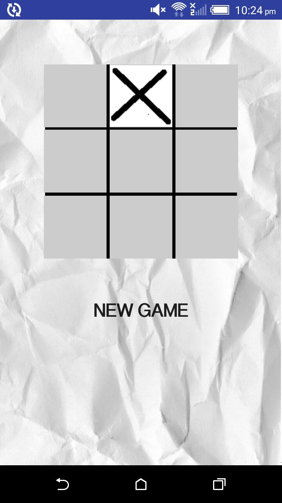
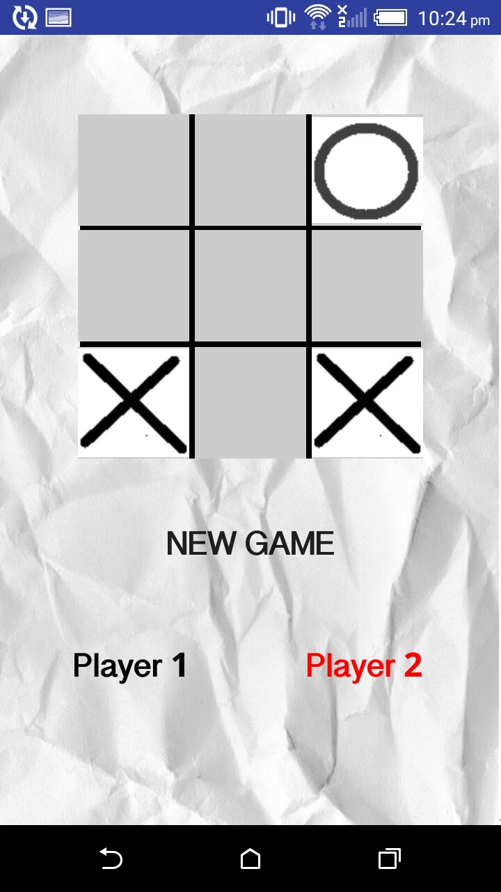

##Tic-Tac-Toe :video_game:

###Overview: 
A simple Android Application based on the paper-and-pencil game for two players, X and O, who take turns marking the spaces in a 3×3 grid. 

###Rules: 
Well, there really is but one rule! The player who succeeds in placing three of their marks in a horizontal, vertical, or diagonal row wins the game.

###Modes:
  -[Single Player](#single-player)  : Bogged down with boredom? Play against the computer!
  
  -[Multi Player](#multi-player)    : Challenge your friends to play against you. 

###Screenshots:
####Single Player: 

####Multi Player

Made with :heart: 
 

 

